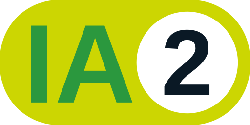

# Document d'approbation du projet

## Description globale

L'élève devra produire un court texte présentant son projet de session

## Consignes

Vous devez rediger un texte d'une longueur d'un maximum de 500 mots décrivant : 

- La nature de votre projet
- Quelle sera la ou les technologies utilisées
- Une courte description du prototype que vous développerez (ses fonctionnalités et attentes) 

votre document doit aussi comporter une [matrice d'Eisenhower](../notes/matrice_eisenhower.md) décrivant les grandes lignes de votre planification en vue de la réalisation de votre projet.

!!! Attention

    Ce document est une présentation de votre projet de session. Il sera utilisé par votre enseignant pour vous donner l'approbation de débuter votre projet.

## Niveau d'intégration de l'intelligence artificielle

<section class="niveau-ia-evaluation">
    <a href="https://techinfo.profinfo.ca/niveaux-ia/" target="_blank">
        
        Assistant à la réflexion sur une production
    </a>
</section>

## Modalités d'évaluation et de remise

**Pondération** : Formatif

- Le travail doit être en format Word et intitulé **NomPrenom_approbation.docx**
- La remise se fera via un devoir dans l'équipe Teams du cours.
- [Grille d'évaluation](../fichiers/grille_approbation_projet.pdf){target=_blank}