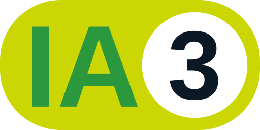

# Épreuve finale (Projet de session)

## Description globale

L'épreuve finale est composé en deux parties : 

- Un projet de recherche sur une technologie actuelle entamé à la 3ème semaine de cours et qui s'étend sur toute la session. Vous aurez à choisir et évaluer une technologie, rechercher de l'information sur ses concepts et donner un avis éclairé sur celle-ci. 
- Une preuve de concept (prototype) qui sera aussi développé pour appuyé votre décision.

**Apprentissages visés** : Cette évaluation est liée aux éléments de compétence suivant : 

- 000SF : Évaluer des composants logiciels et matériels
    - 1 - Cerner les exigences techniques d’un projet de développement ou de déploiement
    - 2 - Rechercher des composants logiciels et matériels
    - 3 - Formuler des avis sur les composants logiciels et matériels

- 00SH : S’adapter à des technologies informatiques 
    - 1 - Effectuer une veille technologique

## Consigne

### Choix de la technologie

- Vous devez choisir d'étudier une technologie émergente qui vous intéresse et que vous n'avez jamais utilisée durant votre parcours au cégep.
- Élaborez un projet que vous voulez faire avec cette technologie et rédiger un [document d'approbation du projet](./approbation.md). 
- Votre enseignant doit approuver votre choix et au besoin il recadrera les limites de votre projet.

### Rapport de recherche

Le rapport de recherche est un document au format Word qui résume vos expérimentations. On y retrouve aussi vos réflexions et avis sur la technologie que vous avez utilisée. En plus d'une page titre et d'une table des matières, le document doit comporter les éléments suivants: 

**Retour sur la technologie**

- Une introduction qui présente la nature du projet et les attentes que vous aviez quand vous avez débuté le projet. 
- Une explication des concepts de la technologie appuyée d'une carte mentale.
- Un avis juste et éclairé sur votre choix technologiques. Dans cet avis vous devez aussi faire un comparatif avec d'autres technologies semblable à l'aide d'une matrice de décision.

---

**Métier d'un technicien utilisant la technologie**

- Le titre du poste
- Les compétences requises pour le poste
- Les tâches effectuées par le titulaire du poste
- Une brève description du poste
- Le salaire moyen (citez la source de l'information)

---

**Retour sur l'élaboration du prototype**

- Un relevé complet des exigences techniques du projet.
- Une description sous forme de fiche de dépannage de 3 problèmes que vous avez rencontré. Dans votre fiche de dépannage vous devez expliquer le problème, énoncer les causes possibles et présenter la solution que vous avez adoptée. Si pertinent ajouter des captures d'écrans ou des extraits de codes.
- Un court texte qui explique comment votre prototype réussi à atteindre les attentes du projet. Si vous n'avez pas réussi, expliquez les raisons de cet échec.
- Un avis sur la longévité, la stabilité, l’efficacité et la maintenabilité des composants en relation avec vos recherches et vos expérimentations.

---

**Recherche et documentation**

- Une veille technologique avec au moins une entrée par semaine. Utilisez le format décrit dans les notes sur les [veilles technologiques](../notes/veille_technologique.md)
- Une bibliographie des références utilisées.

### Prototype

Vous devez développer un prototype utilisant la technologie choisie. Les fonctionnalités du prototype doivent répondrent aux attentes énoncées dans le document d'approbation du projet. 

Vous devez présenterer et expliquer le fonctionnement de votre prototype lors d'une rencontre avec votre enseignant.

## Niveau d'intégration de l'intelligence artificielle

    <a href="https://techinfo.profinfo.ca/niveaux-ia/" target="_blank" style="display:flex;align-items:center;">
    
        Assistant à l'élaboration partielle d'une production
    </a>

## Modalités d'évaluation et de remise

**Pondération** : 70%

 - Le rapport de recherche doit être un document au format Word intitulé **NomPrenom_RapportRecherche.docx**
 - Il sera remis dans un devoir Teams à la dernière semaine de cours (La date sera précisée dans le devoir)
 - Le prototype sera présenté en classe ou individuellement avec l'enseignant durant les deux derniers cours.
 - [Grille d'évaluation](../fichiers/grille_epreuve_finale.pdf){target=_blank}

