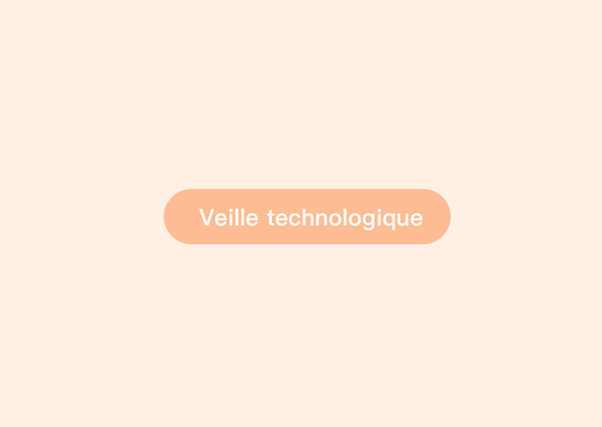
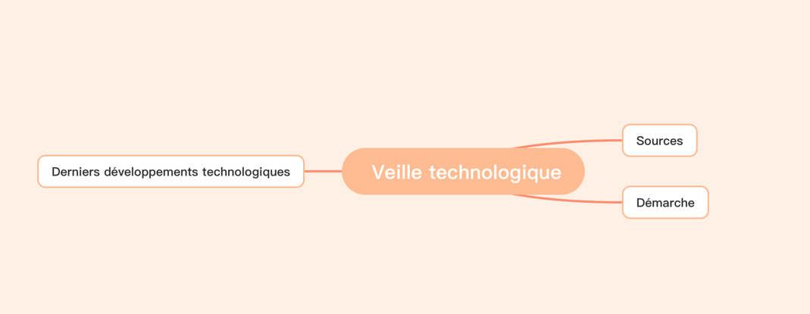
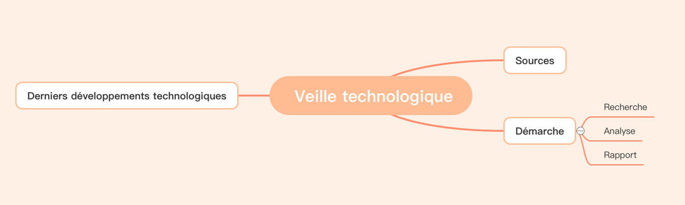
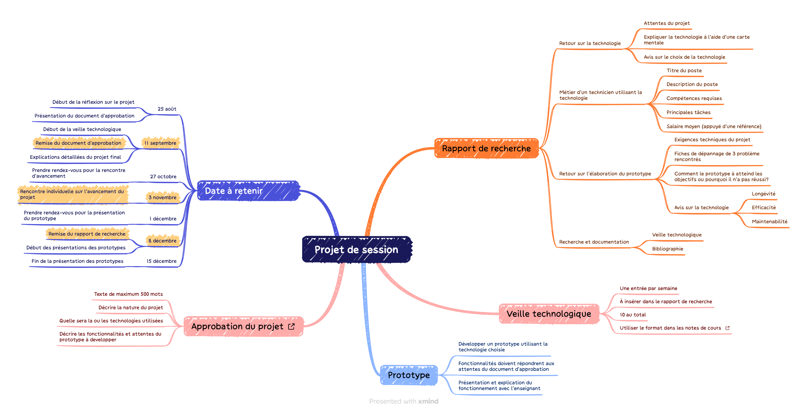

# Carte mentale (Mind map) 

Une carte mentale est une représentation visuelle d'un sujet ou d'une idée. 

C'est une méthode qui permet : 

- de stocker de l'information et de la retrouver rapidement
- d'organiser ses connaissances
- d'apprendre, de réviser et de mémoriser un nouveau concept

Contrairement à des notes traditionnelles prises sous forme de texte, la carte mentale permet aussi de voir rapidement les liens entre les différentes idées.

## Avantages

- **Facilite la compréhension** : permet de voir l'ensemble d'un sujet rapidement.
- **Montre les liens entre les idées** : les concepts reliés sont visuellement regroupés.
- **Stimule la créativité** : favorise l'utilisation de couleur, d'images et de format plus éclaté.
- **Aide à mémoriser** : les mots-clés, les couleurs et les images peuvent faciliter la mémorisation.
- **Organise l'information** : permet de structurer un sujet complexe de manière claire.
- **Facilite la révision** : on peut rapidement retrouver les concepts importants.

## Comment on fait?

On commence généralement par placer le sujet principal au centre, puis on ajoute des branches qui représentent les idées importantes. Ces branches peuvent ensuite se diviser en sous-idées.

Commençons avec un concept central du cours, la veille technologique.  

!!! figure "Concept central"
    

    La base de la veille technologique   

Durant le cours, vous allez découvrir des sujets reliés au concept central :  

!!! figure "Concept avec sujets reliés"
    

    Quelques sujets reliés à la veille technologique     

Pour bien comprendre le sujet, il faut parfois faire des recherches pour approfondir certains aspects. Par exemple, la démarche pourrait être détaillée comme suit :  

!!! figure "Approfondir un aspect"
    
    
    Détail du concept de démarche  

### Résultat  

[Cartographie complète de la veille technologique](https://gitmind.com/app/docs/mfaho29l)  

### Un autre exemple

Voici un autre exemple de carte mentale qui représente le projet de session. Les informations peuvent différer de l'énoncé de l'évaluation finale, veuillez toujours vous référer à ce dernier.

<figure markdown>
  {.center .shadow}
  <figcaption><a href="../images/mindmap_projet_session.png" target="_blank">Image en taille réelle</a></figcaption>
</figure>

## Outils en ligne

Outil que vous pouvez utiliser pour créer vos cartographies :  

- [Xmind.com](https://xmind.com/){target=_blank}
- [Git Mind](https://gitmind.com){target=_blank}
- [Coggle](https://coggle.it/){target=_blank}

## Médiagraphie

- Le guide complet du mindmapping. XperienceRH. (2025, October 6). [https://xperiencerh.com/guide/le-guide-complet-du-mindmapping/](https://xperiencerh.com/guide/le-guide-complet-du-mindmapping/){target=_blank} 