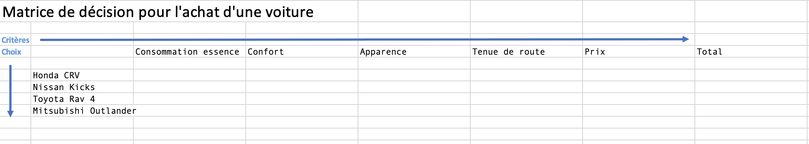
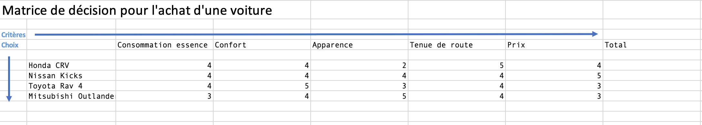
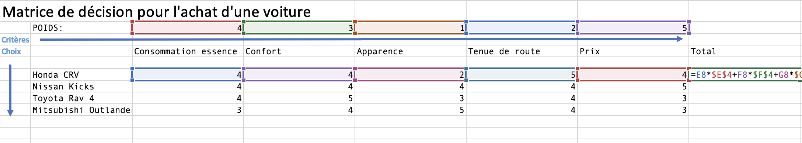
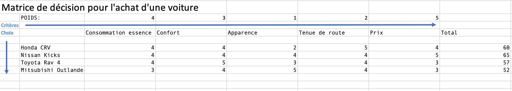

# Les matrices de décision

## Définition  

Une matrice de décision est un outil qui aide les gens à évaluer leurs options avec plus de clarté et d’objectivité. Une matrice de décision peut :  

- Réduire la fatigue décisionnelle.  
- Réduire la subjectivité dans la prise de décisions.  
- Clarifier et prioriser les options.  

Les grilles de prise de décision décrivent les critères de prise de décision et les classent en fonction des facteurs les plus importants. Ces grilles fournissent aux analystes une méthode mesurable pour évaluer systématiquement leurs options.  

## Étapes pour créer une matrice de décision  

Dans un chiffrier Excel, faire un tableau avec les critères d'évaluation en colonnes et les choix en lignes.  

!!! figure "Début de la matrice"
    
    Quelle auto vais-je acheter?  

Donner une note de 1 à 5 pour chaque critère et chaque choix.  1 c'est le moins bon ou le plus bas et 5 le meilleur ou le plus haut.  

!!! figure "Matrice remplie"
    
    J'ai évalué chaque voiture.  

Les critères n'ont pas tous la même importance. Il faut ajouter un poids à chaque critère. De 1 étant le critère le moins important pour vous jusqu'à 5 qui est votre plus important.  

!!! figure "Matrice remplie avec le poids"
    
    J'ai évalué l'importance de chaque critère.

Le calcul du total est la somme des multiplications de chaque note avec son poids.  

!!! figure "Formule de calcul du total"
    

!!! figure "Matrice remplie avec les totaux"
    
    J'ai trouvé quelle voiture je vais acheter!   

## Références  

Lucid Chart. (2021). How BAs Can Use a Decision Matrix to Make Tough Choices. [https://www.lucidchart.com/blog/how-to-make-a-decision-matrix](https://www.lucidchart.com/blog/how-to-make-a-decision-matrix){target=_blank}