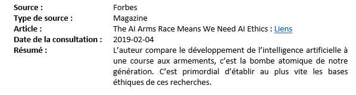

# Veille technologique

## Qu'est-ce qu'une veille technologique?

La veille technologique se décrit comme une série d'actions :  

- Surveiller les développements de la technologie  
- Évaluer les facteurs de risques lors du choix d'une technologie  
- S'informer de façon systématique sur les techniques les plus récentes  

**Pourquoi une veille technologique**  

Une veille technologique a plusieurs buts :  

- Rester à jour  
- Découvrir la prochaine technologie à utiliser dans un projet  

Rester à jour est essentiel en TI.  Le domaine évolue rapidement et faire sa veille permet de ne pas devenir désuet.  De plus, c'est motivant d'en apprendre plus sur les nouvelles technologies ou la nouvelle version de son langage préféré.  Faire une veille pour rester à jour doit être continuelle.  

## Les avantages et inconvénients

Avantages:

- Découvrir de nouvelle technologies
- Renforcer ses connaissances
- Épanouissement professionnel
- Optimiser sa carrière

Désavantage: 

- Le temps

## Les outils pour faire sa veille technologique

En utilisant de bons outils on peut grandement réduire le temps passé à faire notre veille.

### Flux RSS

Un flux RSS est généralement un fichier XML lié à un site Web contenant des informations comme :

- le titre de l'article
- sa description
- sa date de publication
- un lien vers l'article

Quand le site publie un nouvel article, son flux RSS est mis à jour et on peut le récupérer avec un lecteur RSS, un logiciel dont la fonction est de suivre plusieurs flux RSS.

**Quelques lecteurs RSS**

- [Feedly](https://feedly.com/){target=_blank}
- [Flipboard](https://flipboard.com/){target=_blank}
- [Inoreader](https://www.inoreader.com/){target=_blank}
- [Freshrss](https://freshrss.org/index.html){target=_blank}: Open-source qu'on peut héberger nous-même

### Newsletter

Vous recevez à régulièrement un courriel avec des liens vers plusieurs articles sur un sujet choisi. 

Ne vous abonnez pas à trop de newsletter en même temps, au risque d'avoir plusieurs nouvelles en double ou de n'être pas capable de tout trier.

- [https://tldr.tech/](https://tldr.tech/){target=_blank}: Très complet, on peut s'abonner aussi à des sujets plus précis
- [http://thisweekinreact.fr](http://thisweekinreact.fr){target=_blank}: React
- [https://bytes.dev/](https://bytes.dev/){target=_blank}: JavaScript

### Medias sociaux

- Twitter
- Reddit (r/developpeurs ou r/programming par exemple)
- LikedIn
- Facebook

### Podcast

Moins concis qu'un article mais peut être écouté dans nos temps libre.

### Zotero

Un logiciel qui permet de sauvegarder et de catégoriser des ressources (page Web, magazine, etc.). Utilisé avec son extension pour navigateur, c'est une bonne méthode pour rapidement sauvegarder une page intéressante pour plus tard.

En plus Zotero nous permet d'exporter une mediagraphie de nos ressources, pratique quand on fait des recherches.

[https://www.zotero.org/](https://www.zotero.org/){target=_blank}

### Autres sources d'information

- Sites Web 
- Experts du domaine  
- Collègues et amis  
- Livres  
- Revues  

## Comment faire sa veille technologique 

C'est important d'être discipliné et de suivre une méthode qui nous convient pour faire notre veille, sinon on va perdre du temps ou arrêter de la faire.

À vous de voir ce qui vous convient le mieux, je vous donne un exemple de méthode d'un développeur expliquer dans cette vidéo

<iframe width="560" 
  height="315" 
  src="https://www.youtube.com/embed/4dekdBPTHkU?si=hCA3Lfyf7aZoCOrf" 
  title="YouTube video player" 
  frameborder="0" 
  allow="accelerometer; autoplay; clipboard-write; encrypted-media; gyroscope; picture-in-picture; web-share" 
  referrerpolicy="strict-origin-when-cross-origin" 
  allowfullscreen
  class="center">
</iframe>

Pour résumé: 

- Être discipliné, consulté souvent nos outils
- Faire un premier filtre, remettre à plus tard ce qui est intéressant
- Dès que j'ai du temps, je lis ma liste des articles intéresants

## Format à utiliser dans le cours

Je vous demande dans le projet de session de faire une veille technologique. Voici le format que je veux que vous utilisiez : 

- **Source**: D'où provient le document? (Nom du site internet, de la publication, etc.)
- **Type de source**: Magazine, Podcast, Site internet, etc.
- **Article**: Titre de l'article et lien url quand disponible. S'il n'est pas disponible ajoutez une ligne après article intitulé *Référence :* et la référence APA7 vers la source
- **Date de la consultation** : La date à laquelle vous avez consulté la source.
- **Résumé**: Un résumé de la source et de ce que vous retenez.

<figure markdown>
  {.center .shadow}
  <figcaption>Exemple d'entrée avec le format attendu</figcaption>
</figure>

## Références  

- Lagacé, C. (2019). Veille technologique. [https://apical.xyz/formations/veille_techno#chapitre-grilles_de_correction_002](https://apical.xyz/formations/veille_techno#chapitre-grilles_de_correction_002)  
- OQLF. (2009). Définition de veille technologique. Grand dictionnaire terminologique. [http://gdt.oqlf.gouv.qc.ca/ficheOqlf.aspx?Id_Fiche=8869935](http://gdt.oqlf.gouv.qc.ca/ficheOqlf.aspx?Id_Fiche=8869935)  
- Soyes, A. (2021). Veille technologique : Le guide pour les développeurs. [https://alexsoyes.com/veille-technologique/](https://alexsoyes.com/veille-technologique/)  
